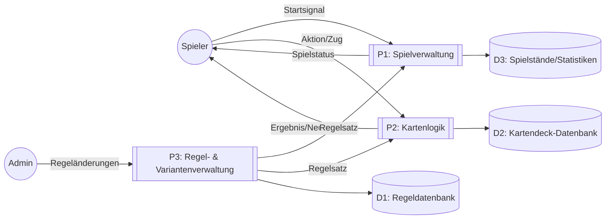

# Product-Goal

## 1\. Ist-Zustand

### 1.1 Wie wird heute gearbeitet?

* Spieler nutzen ein einfaches Kartendeck, das ohne digitale Unterstützung oder Zusatzmaterial auskommt. Die Regeln werden meist mündlich erklärt und variieren je nach Runde.
* Das Spiel wird in kleinen Gruppen gespielt, wobei viel Zeit für das Sortieren, Mischen und Erklären der Karten verloren geht.


### 1.2 das Problem/Bedürfnis damit?

* Neue Spieler fühlen sich oft überfordert, weil die Regeln nicht einheitlich dokumentiert sind und Interpretationsspielraum lassen. Dadurch entstehen Missverständnisse und das Spieltempo leidet.
* Viele wünschen sich klarere Strukturen, schnellere Runden und zusätzliche Spielvarianten, um langfristig motiviert zu bleiben.


### 1.3 Ist-Kontext
#### 1.3.1 UML Use-Case Diagramm – Beschreibung

```mermaid
usecaseDiagram
  actor Spieler as S
  actor Admin as A

  rectangle KartenspielSystem {
    usecase "Spiel starten" as UC1
    usecase "Regeln anzeigen" as UC2
    usecase "Karten mischen" as UC3
    usecase "Karten austeilen" as UC4
    usecase "Zug ausführen" as UC5
    usecase "Spielvarianten auswählen" as UC6
    usecase "Spielstand speichern" as UC7
    usecase "Regeln verwalten" as UC8
  }

  S --> UC1
  S --> UC2
  S --> UC3
  S --> UC4
  S --> UC5
  S --> UC6
  S --> UC7

  A --> UC8
``` 

---

#### 1.3.2 DFD – Data Flow Diagram (Level 0)



---

#### 1.3.3 API – Beispielhafte Endpunkte

##### Spielverwaltung
- `POST /game/start` – Startet ein neues Spiel, gibt Spiel-ID zurück.  
- `POST /game/{id}/join` – Spieler tritt einer Runde bei.  
- `GET /game/{id}/state` – Liefert aktuellen Spielstatus.  

##### Kartenlogik
- `POST /game/{id}/shuffle` – Mischt das Deck.  
- `POST /game/{id}/deal` – Teilt Karten an Spieler aus.  
- `POST /game/{id}/play` – Spieler führt einen Zug aus.  
- `GET /game/{id}/hand/{player}` – Gibt Handkarten eines Spielers zurück.  

##### Regelverwaltung
- `GET /rules` – Liefert alle Regeln.  
- `POST /rules/update` – Aktualisiert Regelsätze (Admin).  
- `GET /variants` – Liefert verfügbare Spielvarianten.  

---

#### 1.3.4 UI-Beschreibung inkl. Rollen

##### Rolle: Spieler – Hauptbildschirm
- Oben: Spielstatus (Runde, aktiver Spieler, Punkte).  
- Mitte: Spielfeld mit abgelegten Karten.  
- Unten: Handkarten des Spielers (horizontal scrollbar).  
- Links: Button „Regeln anzeigen“.  
- Rechts: Button „Spielvarianten“.  

##### Rolle: Admin – Admin-Dashboard
- Liste aller Regelsätze.  
- Aktionen: „Bearbeiten“, „Neue Variante“, „Regeln exportieren“.  
- Statistikbereich: durchschnittliche Spieldauer, beliebteste Varianten.  

---

#### 1.3.5 Vorhandene/gelebte Geschäftsprozesse

##### Spielvorbereitung
- Spieler treffen sich physisch, mischen Karten manuell und erklären Regeln mündlich.  
- Rollen (z. B. Dealer) werden spontan vergeben.  

##### Spielablauf
- Spieler ziehen Karten, spielen Züge und diskutieren Regeln bei Unklarheiten.  
- Bei Streitfällen wird improvisiert oder abgestimmt.  

##### Rundenabschluss
- Punkte werden manuell gezählt.  
- Karten werden neu sortiert und gemischt.  

##### Wissensweitergabe
- Regeln werden mündlich weitergegeben, oft unvollständig oder unterschiedlich interpretiert.  

---

#### 1.3.6 Gesetzliche Vorschriften (relevant für digitale Umsetzung)

- Datenschutz: DSGVO (Nutzerdaten, Accounts, Statistiken).  
- Urheberrecht: UrhG (Kartendesigns, Grafiken, Namen).  
- Verbraucherschutz: Preisangaben, digitale Inhalte, ggf. In-App-Käufe.  
- Jugendschutz: Altersfreigaben, Online-Spiel-Richtlinien.


